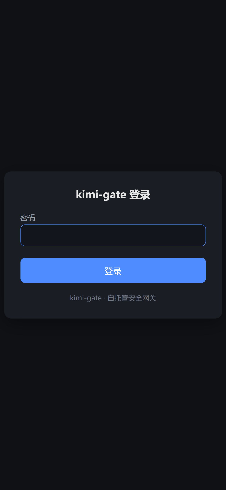
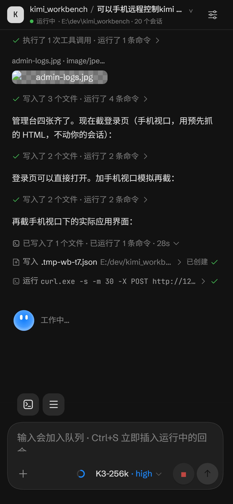
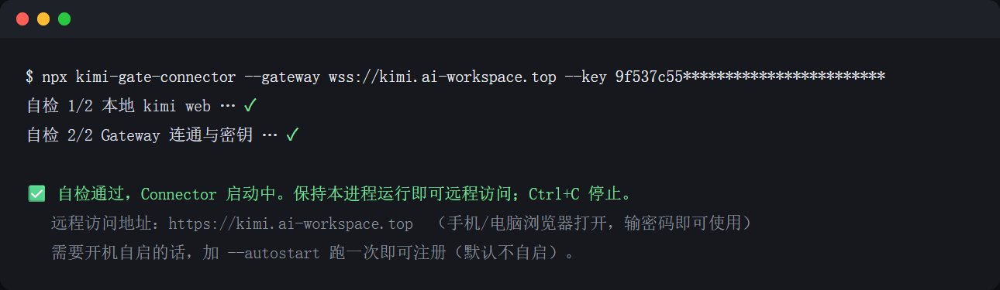
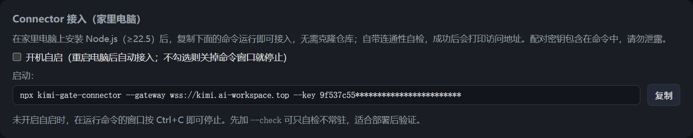
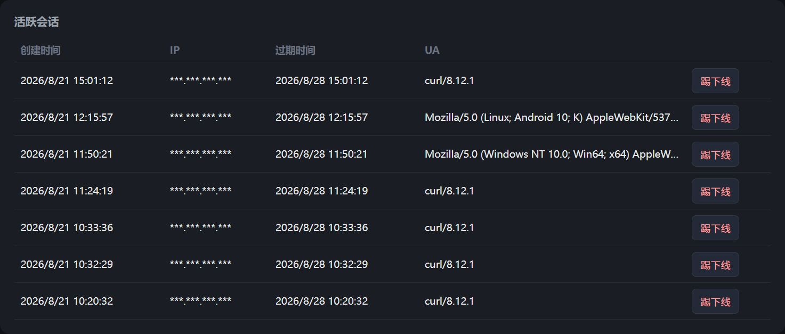
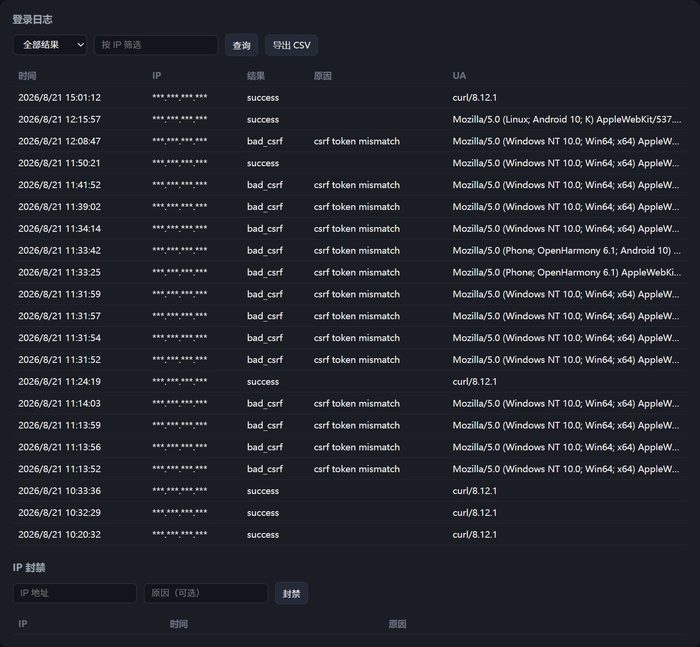

# kimi-gate

自托管安全网关：出门在外，用手机浏览器远程访问家里电脑上的 Kimi Code CLI `kimi web`。

[](https://www.npmjs.com/package/kimi-gate-connector)
[](https://github.com/coconilu/kimi-gate/actions/workflows/ci.yml)
[](LICENSE)
[](https://coconilu.github.io/kimi-gate/)

> 📖 **只想快速用起来？** 看 [用户指南](docs/USER_GUIDE.md)——架构图、15 分钟上手、安全问答、故障排查，不需要技术背景。

## 效果预览

手机浏览器打开自己的域名，输密码即可远程使用 Kimi Code：

 

家里电脑一行 npx 命令接入（无需克隆仓库，自带连通性自检）：



自带管理台（`/admin`，进入需二次密码确认）：Connector 接入命令一键复制、修改密码、活跃会话管理、登录日志与 IP 封禁：



| 修改密码 | 活跃会话 |
|---|---|
|  |  |



## 快速开始

不用看文档，也不用懂部署——把下面这段话发给你的 AI 编程助手（Kimi Code / Claude Code / Cursor 等），它会全程引导你完成，包括帮你选服务器、生成密码、配域名解析，直到你能用手机登录：

> 请阅读 https://github.com/coconilu/kimi-gate/blob/main/docs/AGENT_PLAYBOOK.md ，然后全程引导我完成 kimi-gate 的部署。我手上有一台会一直开机的电脑（装着 Kimi Code CLI），其他都还没有。请一步一步来，每个阶段告诉我该做什么。

Agent 会按 [docs/AGENT_PLAYBOOK.md](docs/AGENT_PLAYBOOK.md)（部署操作手册，含过程总览表和真实踩坑记录）执行：选购建议 → 买服务器 → 域名解析 → 装 Gateway → HTTPS → 装 Connector → 验收 → 安全收尾。你只需要做选择题和点确认。

想自己手动部署？看 [手动部署](#手动部署)。

## 架构

支持两种部署路线。

**路线 A · 同机直连**（`UPSTREAM_MODE=local`）：kimi web 就跑在这台 VPS 上，Gateway 直接回环代理，无需 Connector。

```
┌──────────────┐   HTTPS    ┌────────────────────────────────────────────┐
│  手机浏览器    │ ─────────▶ │  VPS (Node 24)                              │
│  (鸿蒙/任意)   │  密码+TOTP │  Gateway ──回环 127.0.0.1──▶ kimi web:58627 │
└──────────────┘            │  登录/会话/审计/限流/管理台 + 注入Bearer头     │
                            └────────────────────────────────────────────┘
```

**路线 B · 隧道**（`UPSTREAM_MODE=tunnel`，默认）：kimi web 在家里 PC 上，Connector 出站长连接，家里零端口开放。

```
┌──────────────┐   HTTPS    ┌─────────────────────────┐   WSS 出站长连接   ┌──────────────────┐
│  手机浏览器    │ ─────────▶ │  Gateway (VPS, Node 24)  │ ◀──────────────── │ Connector (家里PC) │
│  (鸿蒙/任意)   │  密码+TOTP │  登录/会话/审计/限流/管理台 │   多路复用隧道      │  仅出站, 零端口开放 │
└──────────────┘            │  反向代理 + 注入Bearer头   │                    └────────┬─────────┘
                            └─────────────────────────┘                          │ 本地回环
                                                                                 ▼
                                                                      kimi web 127.0.0.1:58627
```

**核心安全设计**：kimi web 的 bearer token 只保存在 VPS Gateway 的配置里。Gateway 在向上游转发时注入 `Authorization: Bearer <token>` 请求头，手机端全程不接触该 token；路线 B 下家里 PC 也看不到 token，且家里网络零端口开放——Connector 只建立出站长连接。

## 手动部署

`pnpm run setup` 初始化向导会让你选择上游模式（A = 同机直连，B = 隧道），也可事后改 `.env` 里的 `UPSTREAM_MODE`。

### 路线 A：同机直连（kimi web 与 Gateway 同机）

1. 初始化时选 `A`，或手动在 `.env` 中设置：
   ```env
   UPSTREAM_MODE=local
   LOCAL_UPSTREAM=http://127.0.0.1:58627
   ```
2. 确保 kimi web 监听在 `LOCAL_UPSTREAM`（本机回环即可，不要对公网开放）。
3. 按下方"路径 A（Docker）"或"路径 B（裸机）"启动 Gateway。
4. **不需要部署 Connector**。local 模式下 `/tunnel` 端点拒绝连接（HTTP 403 后直接断开），管理台状态显示"模式： 同机直连"。

### 路线 B：隧道（kimi web 在家里 PC）

初始化时选 `B`（默认 `UPSTREAM_MODE=tunnel`），启动 Gateway 后在家里 PC 部署 Connector（见下文"Connector"一节）。

### 路径 A：Docker（推荐）

```bash
git clone <repo> kimi-gate && cd kimi-gate

# 1. 初始化（生成密钥、写入 .env，向导中选择路线 A 或 B）
pnpm install && pnpm run setup        # 按提示设置密码、粘贴 kimi bearer token

# 2. 配置域名（Caddy 自动签 Let's Encrypt）
echo "DOMAIN=gate.example.com" >> .env

# 3. 启动
docker compose up -d --build
```

### 路径 B：裸机（Linux + Node 24 + systemd）

```bash
git clone <repo> kimi-gate && cd kimi-gate
sudo bash scripts/install.sh        # 检测 Node → pnpm install → build → 初始化向导 → 安装 systemd unit
```

`install.sh` 会生成并启用 `kimi-gate-gateway.service`（模板见 `scripts/kimi-gate-gateway.service`）。
Gateway 本身监听 HTTP，请在前面配 TLS 反代（仓库自带 `Caddyfile`，或你自己的 Nginx/Caddy）。

### Connector（路线 B 专用，家里电脑）

**一行命令接入（推荐）**：家里电脑装好 Node.js（≥22.5）后，登录管理台 `https://<域名>/admin`，在"Connector 接入"区块复制完整命令运行即可，无需克隆仓库：

```bash
npx kimi-gate-connector --gateway wss://<域名> --key <配对密钥>
```

命令启动前会自动自检：本地 kimi web 是否在跑（没在跑会提示你启动，非默认端口会提示用 `--target` 指定）、Gateway 是否可达、配对密钥是否正确。全部通过才进入常驻；加 `--check` 只自检不常驻，适合部署后验证。

**常驻/开机自启**：默认不自启（关掉命令就停）。需要开机自启的话，在同一条命令后加 `--autostart` 跑一次即可注册（Windows 计划任务 / Linux systemd / macOS launchd），`--no-autostart` 撤销。详见 [packages/connector/README.md](packages/connector/README.md)。

**从源码运行**（开发/二开）：

```powershell
git clone <repo> kimi-gate && cd kimi-gate
pnpm install && pnpm run build

# 写配置：复制 packages/connector/.env.example 为 packages/connector/.env，填三项：
#   GATEWAY_URL=wss://gate.example.com
#   CONNECTOR_KEY=<管理台"Connector 接入"区块可见>
#   KIMI_LOCAL_URL=http://127.0.0.1:58627
cd packages/connector
pnpm run start
```

### 使用

手机浏览器打开 `https://gate.example.com` → 输入密码（+TOTP）→ 自动进入 kimi web。
管理台在 `https://gate.example.com/admin`。

## 特性

- 登录认证：管理员密码（argon2id，运行时缺失时回退 scrypt）+ 可选 TOTP 双因素（RFC 6238，无第三方依赖）
- 会话：SQLite 会话表 + HttpOnly/SameSite 签名 Cookie
- 登录限流：按设备指纹（IP + User-Agent）滑动窗口 10 次/分钟，超限 429，窗口数据落库、重启不丢
- 登录审计：所有尝试（成功/密码错误/TOTP 错误/被限流/被封禁/CSRF 拒绝）写入 `login_attempts` 表
- 管理台 `/admin`（进入需再次输入密码）：登录日志查询/筛选/导出 CSV、活跃会话列表与踢下线、IP 封禁/解封、隧道在线状态、修改管理员密码（改密成功后其他所有设备会话立即下线，本设备保持登录）
- 隧道：自研 WSS 多路复用协议，同时支持 HTTP 请求/响应代理与 WebSocket 升级中继（kimi 聊天流是 WebSocket）
- 双上游模式：`tunnel`（Connector 隧道）/ `local`（同机直连），认证、注入、审计、管理台行为完全一致
- Connector：指数退避自动重连、心跳保活、HTTP + WS 转发本地 kimi web
- 数据库：SQLite（Node 内置 `node:sqlite`，零原生依赖、零外部服务）

> **运行要求**：Node.js ≥ 22.5（`node:sqlite`）。Node 22.5–23.x 需加 `--experimental-sqlite`；**推荐 Node 24**（免 flag，`crypto.argon2` 也可用）。包管理用 **pnpm**（Node 自带 corepack：`corepack enable` 一次即可，仓库已用 `packageManager` 字段锁定 pnpm 版本）。

## 开发

```bash
pnpm install          # 安装依赖（pnpm workspaces）
pnpm run setup        # 交互式初始化 gateway 配置
pnpm run build        # tsc 构建全部包
pnpm test            # node:test 单元测试 + 端到端集成测试
pnpm run dev:gateway  # tsx watch 开发模式
pnpm run dev:connector
```

## 配置项

### Gateway（`packages/gateway/.env`，由 `pnpm run setup` 生成）

| 变量 | 必填 | 默认 | 说明 |
|---|---|---|---|
| `PORT` | 否 | `3000` | 监听端口 |
| `HOST` | 否 | `0.0.0.0` | 监听地址 |
| `DB_PATH` | 否 | `./kimi-gate.db` | SQLite 数据库文件路径 |
| `SESSION_SECRET` | 是 | — | 会话 Cookie 签名密钥（setup 自动生成） |
| `ADMIN_PASSWORD_HASH` | 是 | — | 管理员密码哈希（setup 生成，argon2id/scrypt）。初始/找回用；管理台改密后新哈希存 SQLite `settings` 表并优先于此值 |
| `KIMI_BEARER_TOKEN` | 是 | — | kimi web 的 bearer token（仅存于此） |
| `UPSTREAM_MODE` | 否 | `tunnel` | 上游模式：`tunnel`（Connector 隧道）/ `local`（同机直连） |
| `LOCAL_UPSTREAM` | local 模式必填 | `http://127.0.0.1:58627` | `UPSTREAM_MODE=local` 时的本地上游地址 |
| `CONNECTOR_KEY` | tunnel 模式必填 | — | Connector 配对密钥（setup 自动生成；local 模式不需要） |
| `TOTP_SECRET` | 否 | — | TOTP base32 密钥，启用双因素 |
| `TRUST_PROXY` | 否 | `true` | 位于 TLS 反代之后：信任 `X-Forwarded-*` 并设置 `Secure` Cookie |
| `TUNNEL_TIMEOUT_MS` | 否 | `30000` | 上游 HTTP 请求超时（隧道或本地上游） |
| `MAX_BODY_BYTES` | 否 | `33554432` | 代理转发的最大请求体 |

### Connector（`packages/connector/.env`）

| 变量 | 必填 | 默认 | 说明 |
|---|---|---|---|
| `GATEWAY_URL` | 是 | — | Gateway WSS 地址，如 `wss://gate.example.com` |
| `CONNECTOR_KEY` | 是 | — | 与 Gateway 的 `CONNECTOR_KEY` 一致 |
| `KIMI_LOCAL_URL` | 否 | `http://127.0.0.1:58627` | 本地 kimi web 地址 |

`.env` 均在 `.gitignore` 中，密钥不会进 git。

## 隧道协议

> 仅路线 B（`UPSTREAM_MODE=tunnel`）使用。路线 A（local）不挂载隧道逻辑，`/tunnel` 端点对所有连接直接返回 HTTP 403 并断开。

单条 WSS 连接（Connector → Gateway `/tunnel`），JSON 文本帧多路复用（见 `packages/shared/src/index.ts`）：

- 握手：`auth`（配对密钥 + 协议版本，timing-safe 比对）→ `auth_ok` / `auth_err`
- HTTP 代理：`http_req`（id, method, path, headers, base64 body）→ `http_res`（id, status, headers, base64 body），Gateway 侧按 id 配对、超时 30s
- WebSocket 中继：`ws_open` → `ws_opened`，之后双向 `ws_msg`（base64 + binary 标志），任一端 `ws_close`/`ws_error` 收尾
- 保活：应用层 `ping`/`pong` + WS 协议层 ping/pong，75s 无消息即断开重连

## 安全模型

| 威胁 | 对策 |
|---|---|
| kimi bearer token 泄露到手机端 | token 只存 Gateway；Gateway 代理时注入 `Authorization` 头，客户端永不接触 |
| 家里网络暴露面（路线 B） | Connector 仅出站长连接，零端口开放，NAT/防火墙无需改动 |
| 隧道被冒用（路线 B） | 配对密钥 + timing-safe 比对；单连接占位（新连接顶掉旧连接） |
| 本地上游暴露（路线 A） | kimi web 只监听 127.0.0.1 回环；`/tunnel` 端点在 local 模式下拒绝连接（403） |
| 登录爆破 | 设备指纹滑动窗口 10 次/分钟（持久化）+ IP 封禁 + 可选 TOTP |
| 会话劫持 | 随机 192bit 会话 ID + HMAC 签名 Cookie，HttpOnly/SameSite/Secure |
| CSRF | 签名双提交 token（登录表单、管理台确认、管理台写操作） |
| 传输安全 | 全程 TLS（Caddy 自动证书）；Gateway 置安全响应头 |

## 已知限制

- HTTP 代理为全缓冲转发（请求体/响应体整体经隧道），不做流式/SSE 逐块转发；kimi web 的实时聊天走 WebSocket 中继，不受影响
- 单管理员账号；tunnel 模式单 Connector 连接（重连时新连接顶替旧连接）
- 管理台为第一版最小功能集：日志/会话/封禁/隧道状态

## 目录结构

```
kimi-gate/
├── packages/
│   ├── shared/      # 隧道协议帧定义（gateway/connector 共用）
│   ├── gateway/     # VPS 侧：认证、会话、限流、审计、管理台、隧道 hub、反向代理
│   └── connector/   # 家里 PC 侧：出站长连接 + 转发本地 kimi web
├── scripts/         # install.sh、systemd unit、clean
├── Dockerfile       # 多阶段构建（node:24）
├── docker-compose.yml  # gateway + caddy（自动 Let's Encrypt）
└── Caddyfile
```

## 参与开发

`main` 分支受保护：**禁止直接 push / 直接合并**，所有改动走 Pull Request：

1. 从 `main` 切功能分支：`git checkout -b feat/xxx`（或 `fix/xxx`、`chore/xxx`）
2. 提交后推送分支并开 PR：`gh pr create`
3. PR 的 CI（构建 + 全部测试）必须通过，之后 squash merge
4. 发布：合并后在最新 `main` 上打 tag（`git tag vX.Y.Z && git push --tags`），自动发布 npm 包

本地开发：`pnpm install && pnpm build && pnpm test`（Node ≥ 22.5，pnpm 经 corepack 启用）。

## License

[MIT](LICENSE)
